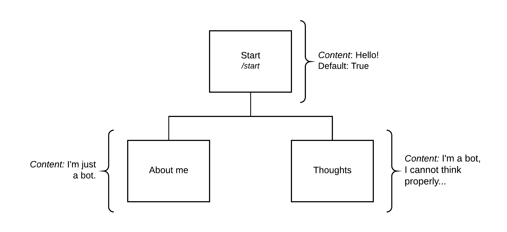

Sample Bot
==========

.. note::
    In order to make use of the proposed example, you need to
    set your own environment by creating a file named ``.env``
    and configuring all the variables from :doc:`sample.env <sample>`.

Structure
---------

Source code
-----------

.. literalinclude:: ../_static/examples/sample_bot.py
