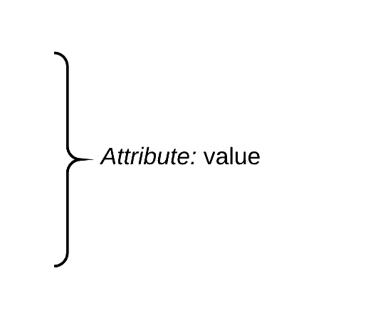
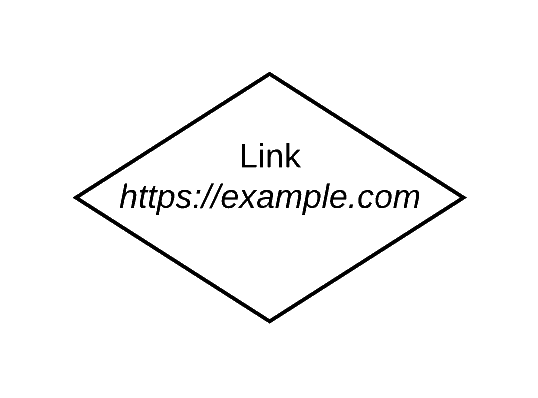

Flowchart guidelines
====================

Here's the documentation for creating a flowchart that represents the skeleton of a :term:`forest <Forest>` (i.e. the final structure of the bot).

Arrows
------

Deep link
~~~~~~~~~

It represents the linking of two menus, a `DeepLinkMenu`, from which the arrow starts, and any instance of `Menu`, towards which the arrow is directed.

Inheritance
~~~~~~~~~~~

It represents the linking of two menus, of which one represents the :term:`parent <Parent menu>` and the other one its relative :term:`child <Child menu>`.

Attributes
----------

It is mostly used it in order to specify some attributes of a menu and it is optional since its presence does not influence the :term:`forest <Forest>` structure of the bot.

Menus
-----

Link menu
~~~~~~~~~

It represents an instance of `LinkMenu`, which means it can also be used for `DeepLinkMenu` objects.

Menu
~~~~

It represents an instance of `Menu`.

Page menu
~~~~~~~~~

It represents, in particular, an instance of `PageMenu`.
