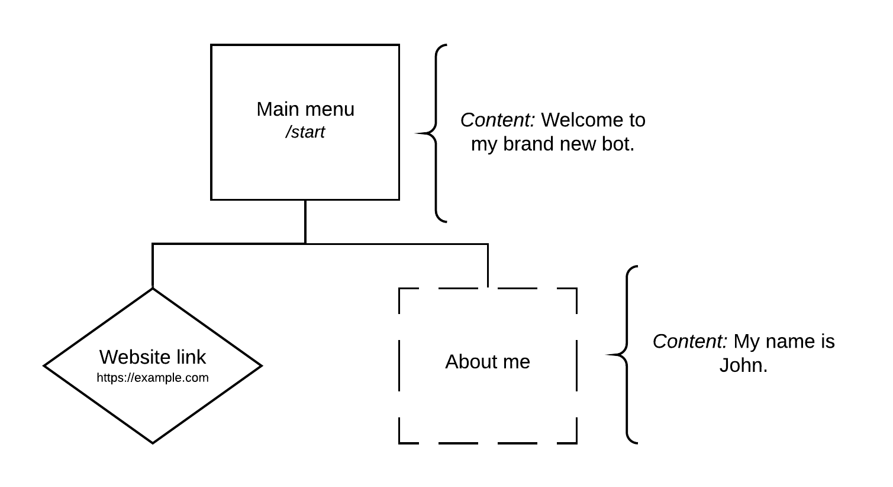

Writing your first bot
======================

.. figure:: https://a.imgur.com/XhInvbp.gif
    :align: center
    :width: 200px

    An example of what you can build using Pyrubrum (see :doc:`Calendar Bot <../examples/calendar_bot>`).

Your first menu
---------------

Pyrubrum is based on menus and `tree <https://en.wikipedia.org/wiki/Tree_structure>`_ structures, which let the user build a bot in a very simple and intuitive way.

For example, we want to create a bot that has got a main menu, callable using the command ``/start``, from which you can access two other menus, one for linking the user to your website and the other one for getting more information about what you do.
The structure is then designed like this:

This can be effortlessly converted to a Pyrubrum tree:

.. code-block:: python

    from pyrubrum import LinkMenu, Menu

    ...

    {
        Menu("Main menu", "start", "Welcome to my brand new bot."): [
            LinkMenu("Website link", "website_link", "https://example.com"),
            Menu("About me", "about_me",
                 "My name is John."),
        ]
    }

Intuitive, isn't it? You can get more information about the classes we've just used at :py:class:`LinkMenu <pyrubrum.LinkMenu>` and :py:class:`Menu <pyrubrum.Menu>`.

Introduction to the forest data structure
-----------------------------------------

You may have noticed it actually isn't a tree, as the main menu is within a set as well. The fact is that Pyrubrum does actually work with `forest <https://magoosh.com/data-science/what-is-forest-data-structure/>`_ data structures, which are just a collection of multiple trees.
That means you can define multiple :term:`top-level menus <Top-level menu>`!

Let's say we want to create two :term:`top-level menus <Top-level menu>`: we've already defined one of them before and we now decide to create a new one for contacting you using the command ``/contact``.

Then the structure has changed to this:

Which translates to:

.. code-block:: python

    from pyrubrum import LinkMenu, Menu

    ...

    {
        Menu("Main menu", "start", "Welcome to my brand new bot."): [
            LinkMenu("Website link", "website_link", "https://example.com"),
            Menu("About me", "about_me",
                 "My name is John."),
        ],
        Menu("Contact me", "contact", "Email me at me@example.com"): [],
    }

Congratulations! You've just written your first :term:`forest <Forest>`!

Linking menus to nodes
----------------------

Since Pyrubrum needs each menu to be linked to a `node <https://en.wikipedia.org/wiki/Node_(computer_science)>`_, we have to modify what we have previously written.
Being Pyrubrum *"batteries included"*, a function that applies to this case is already defined and available and it is none other than `transform <pyrubrum.transform>`.

That's what we will write:

.. code-block:: python

    from pyrubrum import LinkMenu, Menu, transform

    ...

    forest = transform({
        Menu("Main menu", "start", "Welcome to my brand new bot."): [
            LinkMenu("Website link", "website_link", "https://example.com"),
            Menu("About me", "about_me",
                 "My name is John."),
        ],
        Menu("Contact me", "contact", "Email me at me@example.com"): [],
    })

And that's it! We can now integrate our :term:`forest <Forest>` into our bot.

Submitting a forest to an handler
---------------------------------

The :term:`forest <Forest>` structure we've just built up does not do anything by itself.
As a result of this, we need something which is able to handle the messages that our bot is going to receive and redirects them to our menus.
And what can *handle* something better than an *handler* itself?

Parameterized vs non-parameterized handler
~~~~~~~~~~~~~~~~~~~~~~~~~~~~~~~~~~~~~~~~~~

The are two types of handler: the parameterized one (i.e. `ParameterizedHandler`) and the other one which is not (i.e. `Handler`).
Using the first one, you can submit parameters to the bot, store them, add and update information about a user and do much more.
Being our bot a :term:`constant bot <Constant bot>`, we are fine with using an handler that does not :term:`parameterization <Parameterization>`.

Setting an handler
~~~~~~~~~~~~~~~~~~

Since Pyrubrum already makes it simple, we just have to pass the :term:`forest <Forest>` as argument to our handler.
Our example is then going to look like this:

.. code-block:: python

    from pyrubrum import Handler, LinkMenu, Menu, transform

    ...

    handler = Handler(transform({
        Menu("Main menu", "start", "Welcome to my brand new bot."): [
            LinkMenu("Website link", "website_link", "https://example.com"),
            Menu("About me", "about_me",
                 "My name is John."),
        ],
        Menu("Contact me", "contact", "Email me at me@example.com"): [],
    }))

And now we're done with the programming part related to Pyrubrum.

Creating a bot
--------------

In order to access Telegram APIs, we need to have an authorization token that links to the bot you want to make use of, which you can retrieve by talking to `BotFather <https://core.telegram.org/bots#6-botfather>`_. You will also need to create your own API credentials (see https://my.telegram.org/apps).
As soon as you get your credentials, we can start by importing the `Pyrogram <https://docs.pyrogram.org>`_ library and creating a `pyrogram.Client` instance:

.. code-block:: python

    from pyrogram import Client
    from pyrubrum import Handler, LinkMenu, Menu, transform

    bot = Client("ExampleBot",
                 api_hash="<YOUR_API_HASH_GOES_HERE>",
                 api_id="<YOUR_API_ID_GOES_HERE>",
                 bot_token="<YOUR_BOT_TOKEN_GOES_HERE>"
    )

    handler = Handler(transform({
        Menu("Main menu", "start", "Welcome to my brand new bot."): [
            LinkMenu("Website link", "website_link", "https://example.com"),
            Menu("About me", "about_me",
                 "My name is John."),
        ],
        Menu("Contact me", "contact", "Email me at me@example.com"): [],
    }))

We did it! We're now ready for the final part of this tutorial.

Setting up & running a bot
--------------------------

Given an handler, we just have to use the method `setup` and pass our bot instance as argument. Finally, to run it, we will have to call the `run` method of our bot.
It is then built in this way:

.. code-block:: python

    from pyrogram import Client
    from pyrubrum import Handler, LinkMenu, Menu, transform

    bot = Client("ExampleBot",
                 api_hash="<YOUR_API_HASH_GOES_HERE>",
                 api_id="<YOUR_API_ID_GOES_HERE>",
                 bot_token="<YOUR_BOT_TOKEN_GOES_HERE>"
    )

    handler = Handler(transform({
        Menu("Main menu", "start", "Welcome to my brand new bot."): [
            LinkMenu("Website link", "website_link", "https://example.com"),
            Menu("About me", "about_me",
                 "My name is John."),
        ],
        Menu("Contact me", "contact", "Email me at me@example.com"): [],
    }))

    handler.setup(bot)
    bot.run()

Hooray! We've just finished creating our first bot. You're now ready to explore the other available examples.
Check the API documentation as well to deeply understand how Pyrubrum works and to get to know other features that weren't featured in this brief tutorial.

Keep it up!
